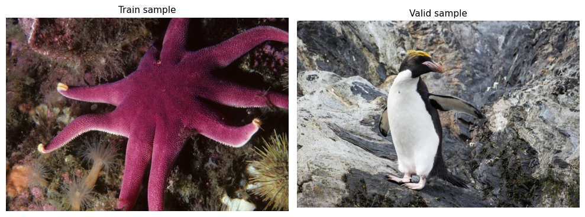
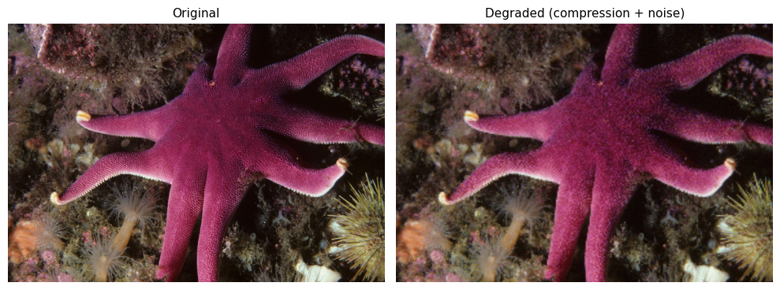
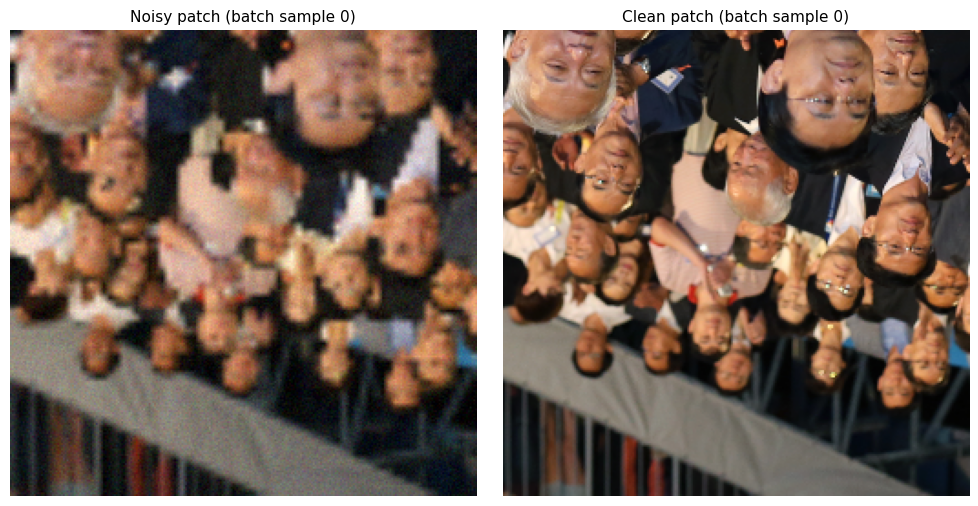
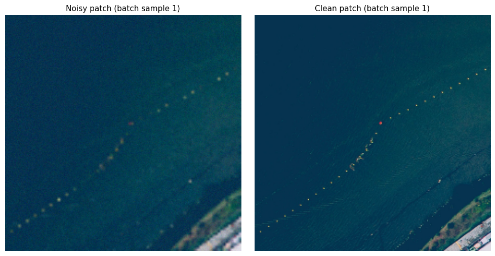
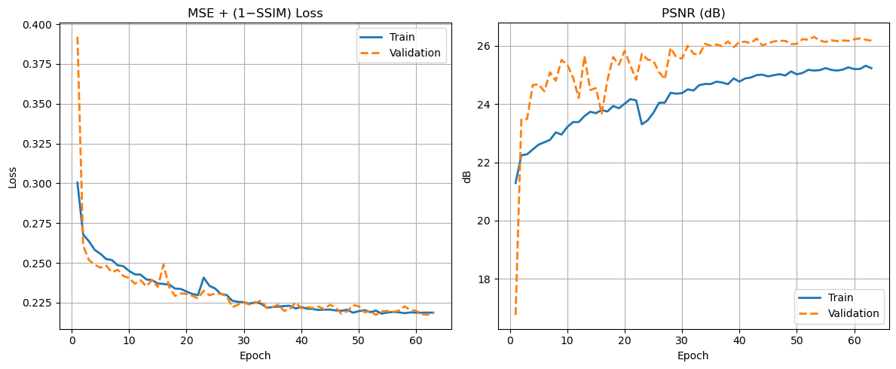
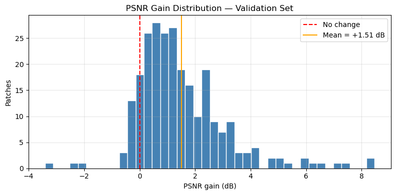
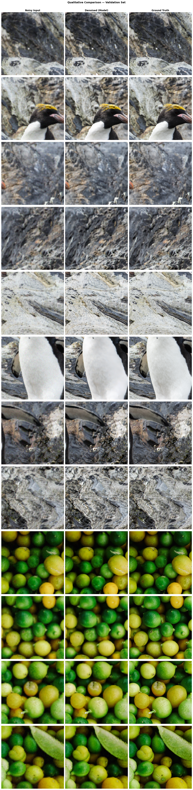

# Image Denoising with U-Net Autoencoder

> A convolutional autoencoder with skip connections trained to remove compression artifacts and Gaussian noise from high-resolution images, using the DIV2K dataset.

---

## Table of Contents

- [Dataset](#dataset)
- [Degradation Model](#degradation-model)
- [Architecture](#architecture)
- [Training](#training)
- [Results](#results)
- [Project Structure](#project-structure)
- [Requirements](#requirements)

---

## Dataset

**DIV2K** (DIVerse 2K resolution) is a high-quality image restoration benchmark dataset widely used in super-resolution and denoising research.

| Split      | Images | Resolution        |
|------------|--------|-------------------|
| Training   | 800    | Up to 2K (varied) |
| Validation | 100    | Up to 2K (varied) |

Images are loaded and resized to a working resolution (`image_size = 1024`), then sliced into non-overlapping **256×256 patches** on the fly. This streaming approach means the full dataset is never held in RAM simultaneously.

**Sample images from the dataset:**



---

## Degradation Model

Each clean patch is synthetically degraded by two independent corruptions applied simultaneously before being fed to the model:

**1. Compression artifact simulation**
The image is downscaled by a random factor (range: 0.25–0.45) and then upscaled back to its original size, mimicking the blocking and blurring introduced by lossy codecs like JPEG.

**2. Per-channel Gaussian noise**
Independent additive Gaussian noise with a randomly sampled standard deviation (range: σ = 3.5–10.0) is applied to each RGB channel.

The result is a stochastic degradation pipeline where no two training passes over the same image produce the same corrupted version, acting as a strong form of data augmentation.



**Sample training patches (noisy / clean pairs):**




---

## Architecture

The model is a **U-Net style convolutional autoencoder** — an encoder-decoder network with skip connections that concatenate encoder feature maps directly into the corresponding decoder stage.

```
Input (256×256×3)
        │
  ┌─────▼─────┐
  │  Conv×2   │  32 filters  ─────────────────────────────────┐ skip
  │  BN, ReLU │                                               │
  └─────┬─────┘                                               │
   MaxPool 2×2                                                │
  ┌─────▼─────┐                                               │
  │  Conv×2   │  64 filters  ──────────────────────────┐ skip │
  │  BN, ReLU │                                        │      │
  └─────┬─────┘                                        │      │
   MaxPool 2×2                                         │      │
  ┌─────▼─────┐                                        │      │
  │  Conv×2   │  128 filters ──────────────────┐ skip  │      │
  │  BN, ReLU │                                │       │      │
  └─────┬─────┘                                │       │      │
   MaxPool 2×2                                 │       │      │
  ┌─────▼─────┐                                │       │      │
  │  Conv×2   │  256 filters  ← Bottleneck     │       │      │
  │  BN, ReLU │                                │       │      │
  └─────┬─────┘                                │       │      │
 ConvTranspose 2×2                             │       │      │
  ┌─────▼─────┐                                │       │      │
  │ concat ◄──┼────────────────────────────────┘       │      │
  │  Conv×2   │  128 filters                           │      │
  └─────┬─────┘                                        │      │
 ConvTranspose 2×2                                     │      │
  ┌─────▼─────┐                                        │      │
  │ concat ◄──┼────────────────────────────────────────┘      │
  │  Conv×2   │  64 filters                                   │
  └─────┬─────┘                                               │
 ConvTranspose 2×2                                            │
  ┌─────▼─────┐                                               │
  │ concat ◄──┼───────────────────────────────────────────────┘
  │  Conv×2   │  32 filters
  └─────┬─────┘
  Conv 1×1 sigmoid
        │
Output (256×256×3)
```

### Design Choices

| Component | Choice | Rationale |
|---|---|---|
| **Skip connections** | Concatenation across encoder/decoder | Preserves fine spatial detail lost during pooling |
| **Upsampling** | `Conv2DTranspose` (learned) | Reduces checkerboard artifacts vs. bilinear + Conv |
| **Normalization** | `BatchNormalization` after every Conv | Stabilizes training, accelerates convergence |
| **Filter depth** | 32 → 64 → 128 → 256 | Captures increasingly abstract features at each scale |
| **Output activation** | Sigmoid | Maps output to [0, 1] range matching normalized inputs |

### Loss Function

The model is trained with a **combined MSE + (1 − SSIM) loss**:

```
L(y, ŷ) = MSE(y, ŷ) + (1 − SSIM(y, ŷ))
```

- **MSE** enforces pixel-level accuracy
- **SSIM** preserves perceptual / structural quality (contrast, luminance, structure)

Using both prevents the common MSE-only failure mode of overly smooth reconstructions that score well numerically but look blurry.

### Optimizer

Adam with `lr = 0.001`, `β₁ = 0.9`, `β₂ = 0.999` (standard, not the more aggressive `β₂ = 0.9` sometimes found in older implementations).

---

## Training

Training runs for up to **80 epochs** with three callbacks:

| Callback | Configuration | Purpose |
|---|---|---|
| `EarlyStopping` | patience=10, restore best weights | Prevents overfitting; stops if val_loss stagnates |
| `BestModelCheckpoint` | monitors `val_loss` (min) | Saves best checkpoint in `.keras` format |
| `ReduceLROnPlateau` | factor=0.5, patience=5, min_lr=1e-6 | Halves LR when plateau detected; helps escape local minima |

**Data augmentation** (applied on-the-fly): random horizontal and vertical flips on both the noisy input and the clean target simultaneously, ensuring geometric consistency.

**Training and validation curves:**



The loss drops sharply in the first ~10 epochs, then continues to improve steadily. Validation PSNR reaches ~26 dB, tracking well above the training PSNR (which is measured on harder, freshly-degraded patches per epoch).

---

## Results

### Quantitative Metrics (Validation Set, 256 patches)

| Metric | Noisy Input | Denoised Output | Gain |
|--------|-------------|-----------------|------|
| **PSNR (dB)** | ~24.5 | ~26.0 | **+1.51 dB** |
| **SSIM** | — | — | positive |

### PSNR Gain Distribution

The histogram below shows the per-patch PSNR gain across the validation set. The vast majority of patches show a positive gain, with a mean improvement of **+1.51 dB**.



### Qualitative Comparison

Each row shows the same 256×256 patch at three stages: noisy input → model output → ground truth.



The model consistently recovers fine textures and removes blur from compressed regions while suppressing high-frequency noise, closely matching the ground truth in both sharp and smooth areas.

---

## Project Structure

```
.
├── AutoEncoders_Denoising.ipynb   # Main notebook
├── checkpoints/
│   └── autoencoder_best_model.keras  # Best saved checkpoint
└── dataset/
    └── DIV2K/
        ├── DIV2K_train_HR/        # 800 training images
        └── DIV2K_valid_HR/        # 100 validation images
```

---

## Requirements

```
tensorflow >= 2.10
numpy
opencv-python
matplotlib
```

**Dataset:** Download DIV2K from [https://data.vision.ee.ethz.ch/cvl/DIV2K/](https://data.vision.ee.ethz.ch/cvl/DIV2K/) and place the `DIV2K_train_HR` and `DIV2K_valid_HR` folders under `~/dataset/DIV2K/`.

---

## Key Implementation Notes

- **Memory-efficient pipeline:** patches are generated on-the-fly from disk via `tf.data.Dataset.from_generator` — the full dataset is never loaded into RAM.
- **Stochastic degradation:** noise and compression scale factors are sampled fresh for every patch on every epoch, providing virtually infinite training variety.
- **Patch-based evaluation:** 256 validation patches are collected once into memory for reproducible metric computation and visualization.
